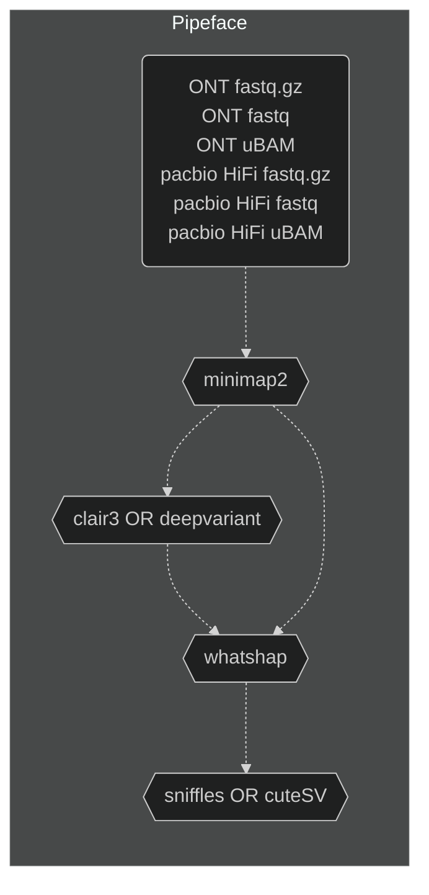
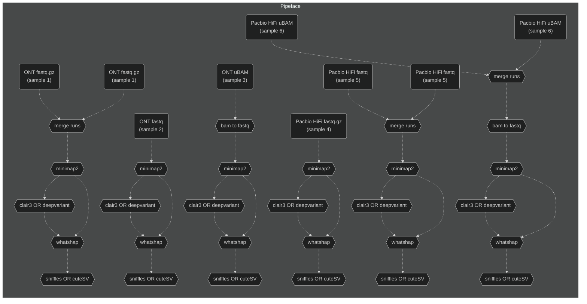

# Pipeface

## Overview

Pipefaceee.

Nextflow pipeline to align, variant call (SNP's, indels's, SV's) and phase long read [ONT](https://nanoporetech.com/) and/or [pacbio](https://www.pacb.com/) HiFi data.

    

## Workflow

### Overview

### Detailed

## Main analyses

- ONT and pacbio HiFi data
- WGS and targeted
- hg38 or hs1 reference genome

## Main tools

- [minimap2](https://github.com/lh3/minimap2)
- [Clair3](https://github.com/HKU-BAL/Clair3) OR [deepvariant](https://github.com/google/deepvariant)
- [whatshap](https://github.com/whatshap/whatshap)
- [sniffles](https://github.com/fritzsedlazeck/Sniffles) OR [cuteSV](https://github.com/tjiangHIT/cuteSV)

## Main input files

### Required

- ONT/pacbio HiFi FASTQ (gzipped or uncompressed) or unaligned BAM
- Indexed reference genome
- Clair3 models (if running Clair3)

### Optional

- Regions of interest BED file
- Tandem repeat BED file

## Main output files

- Aligned, sorted and haplotagged bam's
- Clair3 *OR* deepvariant phased SNP/indel VCF file
- Clair3 *OR* deepvariant phase SNP/indel gVCF file
- Sniffles *OR* cuteSV phased SV VCF file

## Assumptions

- Running pipeline on Australia's [National Computational Infrastructure (NCI)](https://nci.org.au/)
- Access to if89 project on [National Computational Infrastructure (NCI)](https://nci.org.au/)
- Access to pipeline dependencies:
    - [Nextflow and it's java dependency](https://nf-co.re/docs/usage/installation). Validated to run on:
        - Nextflow 24.04.1
        - Java version 17.0.2

## Run it!

See a walkthrough for how to [run pipeface on NCI](./docs/run_on_nci.md).

