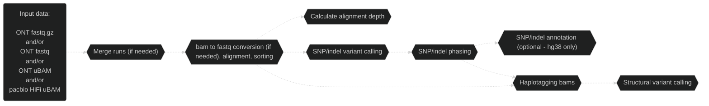
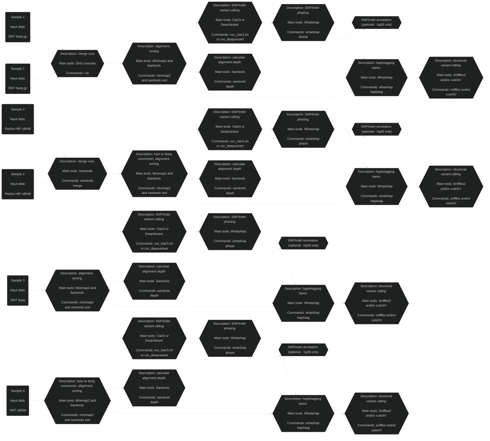

# Pipeface

## Overview

Pipefaceee.

Nextflow pipeline to align, variant call (SNP's, indels's, SV's), phase and annotate (optional) long read [ONT](https://nanoporetech.com/) and/or [pacbio](https://www.pacb.com/) HiFi data.

There currently exists tools and workflows which align, variant call, phase and annotate ONT/pacbio HiFi data, but pipeface serves as a central workflow to process long read data. Pipeface's future hold's STR, CNV and tandem repeat calling, as well as the analysis of cohorts.

    

## Workflow

### Detailed

## Main analyses

- ONT and pacbio HiFi data
- WGS and targeted
- hg38 or hs1 reference genome

## Main tools

- [Minimap2](https://github.com/lh3/minimap2)
- [Clair3](https://github.com/HKU-BAL/Clair3) or [DeepVariant](https://github.com/google/deepvariant)
- [WhatsHap](https://github.com/whatshap/whatshap)
- [Sniffles2](https://github.com/fritzsedlazeck/Sniffles) and/or [cuteSV](https://github.com/tjiangHIT/cuteSV)
- [Samtools](https://github.com/samtools/samtools)
- [ensembl-vep](https://github.com/Ensembl/ensembl-vep)

## Main input files

### Required

- ONT/pacbio HiFi FASTQ (gzipped or uncompressed) or unaligned BAM
- Indexed reference genome
- Clair3 models (if running Clair3)

### Optional

- Regions of interest BED file
- Tandem repeat BED file

## Main output files

- Aligned, sorted and haplotagged bam
- Clair3 or DeepVariant phased SNP/indel VCF file
- Annotated Clair3 or DeepVariant phased SNP/indel VCF file (optional - hg38 only)
- Phased Sniffles2 and/or un-phased cuteSV SV VCF file

## Assumptions

- Running pipeline on Australia's [National Computational Infrastructure (NCI)](https://nci.org.au/)
- Access to if89 project on [National Computational Infrastructure (NCI)](https://nci.org.au/)
- Access to xy86 project on [National Computational Infrastructure (NCI)](https://nci.org.au/) (if running variant annotation)
- Access to pipeline dependencies:
    - [Nextflow and it's java dependency](https://nf-co.re/docs/usage/installation). Validated to run on:
        - Nextflow 24.04.1
        - Java 17.0.2

*[See the list of software and their versions used by this version of pipeface](./docs/software_versions.txt) as well as the [list of variant databases and their versions](./docs/database_versions.txt) if variant annotation is carried out (assuming the default [nextflow_pipeface.config](./config/nextflow_pipeface.config) file is used).*

## Run it!

See a walkthrough for how to [run pipeface on NCI](./docs/run_on_nci.md).

## Credit

This is a highly collaborative project, with many contributions from the [Genomic Technologies Lab](https://www.garvan.org.au/research/labs-groups/genomic-technologies-lab). Notably, Dr Andre Reis and Dr Ira Deveson are closely involved in the development of this pipeline. The installation and hosting of software used in this pipeline has been supported by the [Australian BioCommons Tools and Workflows project (if89)](https://australianbiocommons.github.io/ables/if89/).

