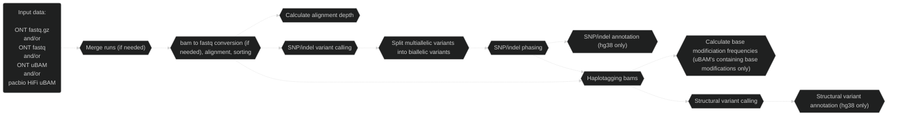
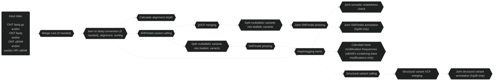

# Pipeface

## Overview

Pipefaceee.

Nextflow pipeline to process long read [ONT](https://nanoporetech.com/) and/or [pacbio](https://www.pacb.com/) HiFi data.

Pipeface's future hold's mitochondrial, STR, CNV and tandem repeat calling.

    

## Workflow

### Singleton

### Duo

### Trio

```mermaid
%%{init: {'theme':'dark'}}%%
flowchart LR

input_data("Input data: <br><br> ONT fastq.gz <br> and/or <br> ONT fastq <br> and/or <br> ONT uBAM <br> and/or <br> pacbio HiFi uBAM")
merging{{"Merge runs (if needed)"}}
alignment{{"bam to fastq conversion (if needed), alignment, sorting"}}
depth{{"Calculate alignment depth"}}
snp_indel_calling{{"SNP/indel variant calling"}}
split_multiallele{{"Split multiallelic variants into biallelic variants"}}
snp_indel_phasing{{"SNP/indel phasing"}}
joint_snp_indel_calling{{"Joint SNP/indel variant calling"}}
joint_somalier{{"Joint somalier relatedness check"}}
gvcf_merging{{"gVCF merging"}}
joint_split_multiallele{{"Split multiallelic variants into biallelic variants"}}
joint_snp_indel_phasing{{"Joint SNP/indel phasing"}}
joint_snp_indel_annotation{{"Joint SNP/indel annotation (hg38 only)"}}
haplotagging{{"Haplotagging bams"}}
calculate_base_mod_freqs{{"Calculate base modificiation frequencies (uBAM's containing base modifications only)"}}
sv_calling{{"Structural variant calling"}}
sv_vcf_merging{{"Structural variant VCF merging"}}
joint_sv_annotation{{"Joint structural variant annotation (hg38 only)"}}

input_data-.->merging-.->alignment-.->snp_indel_calling-.->split_multiallele-.->snp_indel_phasing-.->haplotagging-.->sv_calling
alignment-.->depth
alignment-.->haplotagging
haplotagging-.->calculate_base_mod_freqs
haplotagging-.->joint_somalier
snp_indel_phasing-.->joint_snp_indel_calling-.->gvcf_merging-.->joint_split_multiallele-.->joint_snp_indel_phasing-.->joint_snp_indel_annotation
sv_calling-.->sv_vcf_merging-.->joint_sv_annotation

```

## Main analyses

- ONT and/or pacbio HiFi data
- Singletons, duos or trios
- WGS and/or targeted
- hg38 or hs1 reference genome

## Main tools

- [Minimap2](https://github.com/lh3/minimap2)
- [Clair3](https://github.com/HKU-BAL/Clair3) or [DeepVariant](https://github.com/google/deepvariant)/[DeepTrio](https://github.com/google/deepvariant/blob/r1.8/docs/deeptrio-details.md)
- [WhatsHap](https://github.com/whatshap/whatshap)
- [GLnexus](https://github.com/dnanexus-rnd/GLnexus)
- [Sniffles2](https://github.com/fritzsedlazeck/Sniffles) and/or [cuteSV](https://github.com/tjiangHIT/cuteSV)
- [Jasmine (customised)](https://github.com/bioinfomethods/Jasmine)
- [somalier](https://github.com/brentp/somalier)
- [Samtools](https://github.com/samtools/samtools)
- [mosdepth](https://github.com/brentp/mosdepth)
- [minimod](https://github.com/warp9seq/minimod?tab=readme-ov-file)
- [ensembl-vep](https://github.com/Ensembl/ensembl-vep)

## Main input files

### Required

- ONT/pacbio HiFi FASTQ (gzipped or uncompressed) or unaligned BAM
- Indexed reference genome
- Clair3 models (if running Clair3)

### Optional

- Regions of interest BED file
- Tandem repeat BED file
- PAR regions BED file (if running in haploid aware mode)

## Main output files

### Singleton

- Aligned, sorted and haplotagged bam
- Alignment depth per chromosome (and per region in the case of targeted sequencing)
- Phased Clair3 or DeepVariant SNP/indel VCF file
- Phased and annotated Clair3 or DeepVariant SNP/indel VCF file (hg38 only)
- Clair3 or DeepVariant SNP/indel gVCF file
- Bed and bigwig base modification frequencies for complete read set and separate haplotypes (uBAM's containing base modifications only)
- Phased Sniffles2 and/or un-phased cuteSV SV VCF file
- Phased and annotated Sniffles2 and/or un-phased and annotated cuteSV SV VCF file (hg38 only)

### Duo

- Aligned, sorted and haplotagged bam
- Alignment depth per chromosome (and per region in the case of targeted sequencing)
- DeepVariant SNP/indel gVCF file
- Joint phased DeepVariant SNP/indel VCF file
- Joint phased and annotated DeepVariant SNP/indel VCF file (hg38 only)
- Bed and bigwig base modification frequencies for complete read set and separate haplotypes (uBAM's containing base modifications only)
- Joint phased Sniffles2 and/or un-phased cuteSV SV VCF file
- Joint phased and annotated Sniffles2 and/or un-phased and annotated cuteSV SV VCF file (hg38 only)
- Joint relatedness and quality control somalier TSV and HTML files

### Trio

- Aligned, sorted and haplotagged bam
- Alignment depth per chromosome (and per region in the case of targeted sequencing)
- DeepVariant SNP/indel gVCF file
- Joint phased DeepTrio SNP/indel VCF file
- Joint phased and annotated DeepTrio SNP/indel VCF file (hg38 only)
- Bed and bigwig base modification frequencies for complete read set and separate haplotypes (uBAM's containing base modifications only)
- Joint phased Sniffles2 and/or un-phased cuteSV SV VCF file
- Joint phased and annotated Sniffles2 and/or un-phased and annotated cuteSV SV VCF file (hg38 only)
- Joint relatedness and quality control somalier TSV and HTML files

> **_Note:_** Running DeepVariant/DeepTrio on ONT data assumes r10 data

> **_Note:_** Running base modification analyses assumes the input data is in uBAM format and base modifications are present in these data

## Haploid Aware Mode

- Enables correct handling of the haploid nature of chrX and chrY for XY samples, along with PAR regions
- Only supported for singletons at the moment

## Assumptions

- Running pipeline on Australia's [National Computational Infrastructure (NCI)](https://nci.org.au/)
- Access to if89 project (to access software installs used by pipeface)
- Access to xy86 project (to access variant databases used by pipeface, only required if running variant annotation)

*[See the list of software and their versions used by this version of pipeface](./docs/software_versions.txt) as well as the [list of variant databases and their versions](./docs/database_versions.txt) if variant annotation is carried out (assuming the default [nextflow_pipeface.config](./config/nextflow_pipeface.config) file is used).*

## Run it!

See a walkthrough for [running pipeface on NCI](./docs/run_on_nci.md).

## Credit

This is a highly collaborative project, with many contributions from the [Genomic Technologies Lab](https://www.garvan.org.au/research/labs-groups/genomic-technologies-lab). Notably, Dr Andre Reis and Dr Ira Deveson are closely involved in the development of this pipeline. Optimisations involving DeepVariant and DeepTrio have been contributed by Dr Kisaru Liyanage and Dr Matthew Downton from the [National Computational Infrastructure](https://nci.org.au), with support from Australian BioCommons as part of the Workflow Commons project. Haploid-aware mode has been contributed by Dr Hardip Patel & Kirat Alreja from the [National Centre for Indigenous Genomics](https://ncig.anu.edu.au). The installation and hosting of software used in this pipeline has and continues to be supported by the [Australian BioCommons Tools and Workflows project (if89)](https://australianbiocommons.github.io/ables/if89/).

