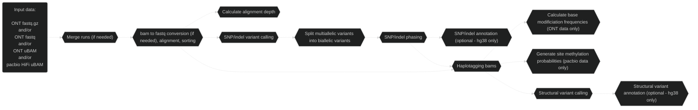
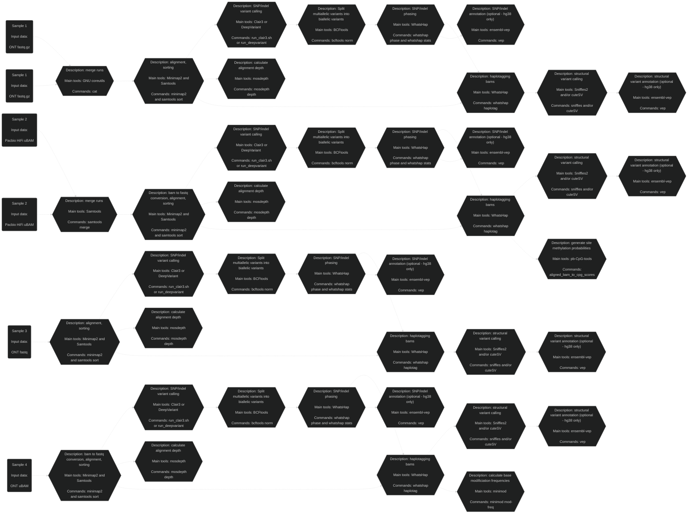

# Pipeface

## Overview

Pipefaceee.

Nextflow pipeline to merge, align, variant call (SNP, indel and SV), phase, haplotag and optionally annotate long read [ONT](https://nanoporetech.com/) and/or [pacbio](https://www.pacb.com/) HiFi data.

There currently exists tools and workflows that undertake comparable analyses, but pipeface serves as a central workflow to process long read data (both ONT and pacbio HiFi data). Pipeface's future hold's STR, CNV and tandem repeat calling, as well as the analysis of cohorts.

    

## Workflow

### Detailed

## Main analyses

- ONT and/or pacbio HiFi data
- WGS and/or targeted
- hg38 or hs1 reference genome

## Main tools

- [Minimap2](https://github.com/lh3/minimap2)
- [Clair3](https://github.com/HKU-BAL/Clair3) or [DeepVariant](https://github.com/google/deepvariant)
- [WhatsHap](https://github.com/whatshap/whatshap)
- [Sniffles2](https://github.com/fritzsedlazeck/Sniffles) and/or [cuteSV](https://github.com/tjiangHIT/cuteSV)
- [Samtools](https://github.com/samtools/samtools)
- [mosdepth](https://github.com/brentp/mosdepth)
- [minimod](https://github.com/warp9seq/minimod?tab=readme-ov-file)
- [pb-CpG-tools](https://github.com/PacificBiosciences/pb-CpG-tools)
- [ensembl-vep](https://github.com/Ensembl/ensembl-vep)

## Main input files

### Required

- ONT/pacbio HiFi FASTQ (gzipped or uncompressed) or unaligned BAM
- Indexed reference genome
- Clair3 models (if running Clair3)

### Optional

- Regions of interest BED file
- Tandem repeat BED file

## Main output files

- Aligned, sorted and haplotagged bam
- Alignment depth per chromosome (and per region in the case of targeted sequencing) (optional)
- Phased Clair3 or DeepVariant SNP/indel VCF file
- Phased and annotated Clair3 or DeepVariant SNP/indel VCF file (optional - hg38 only)
- Bed and bigwig base modification frequencies for complete read set and separate haplotypes (ONT data only)
- Bed and bigwig site methylation probabilities for complete read set and separate haplotypes (pacbio data only)
- Phased Sniffles2 and/or un-phased cuteSV SV VCF file
- Phased and annotated Sniffles2 and/or un-phased and annotated cuteSV SV VCF file

> **_Note:_** Running DeepVariant on ONT data assumes r10 data

> **_Note:_** Running base modification analyses assume the input data is un uBAM format and base modifications are present in these data

## Assumptions

- Running pipeline on Australia's [National Computational Infrastructure (NCI)](https://nci.org.au/)
- Access to if89 project on [National Computational Infrastructure (NCI)](https://nci.org.au/)
- Access to xy86 project on [National Computational Infrastructure (NCI)](https://nci.org.au/) (if running variant annotation)
- Access to pipeline dependencies:
    - [Nextflow 24.04.1 and it's Java 17.0.2 dependency](https://nf-co.re/docs/usage/installation)
    - [mosdepth 0.3.9 binary](https://github.com/brentp/mosdepth/releases/tag/v0.3.9) (if running depth calculation)
    - [pb-CpG-tools 2.3.2 binary](https://github.com/PacificBiosciences/pb-CpG-tools/releases/tag/v2.3.2) (if processing pacbio data)

*[See the list of software and their versions used by this version of pipeface](./docs/software_versions.txt) as well as the [list of variant databases and their versions](./docs/database_versions.txt) if variant annotation is carried out (assuming the default [nextflow_pipeface.config](./config/nextflow_pipeface.config) file is used).*

## Run it!

See a walkthrough for how to [run pipeface on NCI](./docs/run_on_nci.md).

## Credit

This is a highly collaborative project, with many contributions from the [Genomic Technologies Lab](https://www.garvan.org.au/research/labs-groups/genomic-technologies-lab). Notably, Dr Andre Reis and Dr Ira Deveson are closely involved in the development of this pipeline. Optimisations involving DeepVariant have been contributed by Dr Kisaru Liyanage and Dr Matthew Downton from the [National Computational Infrastructure](https://nci.org.au), with support from Australian BioCommons as part of the Workflow Commons project. The installation and hosting of software used in this pipeline has and continues to be supported by the [Australian BioCommons Tools and Workflows project (if89)](https://australianbiocommons.github.io/ables/if89/).

