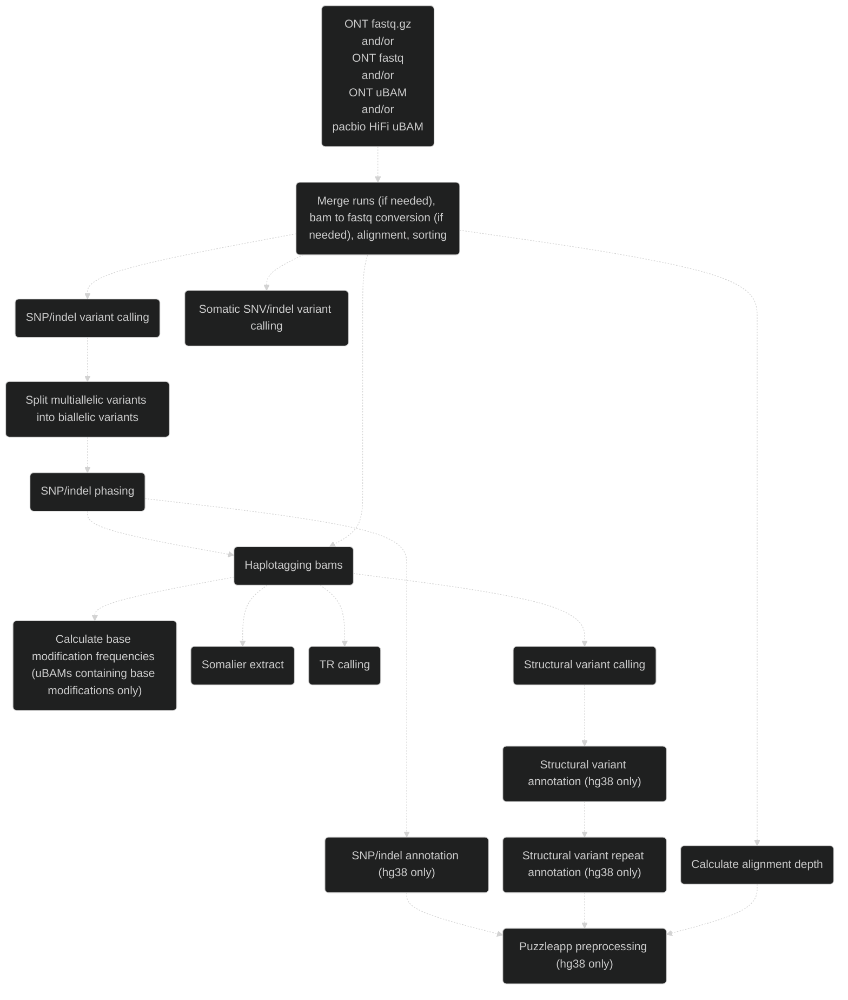
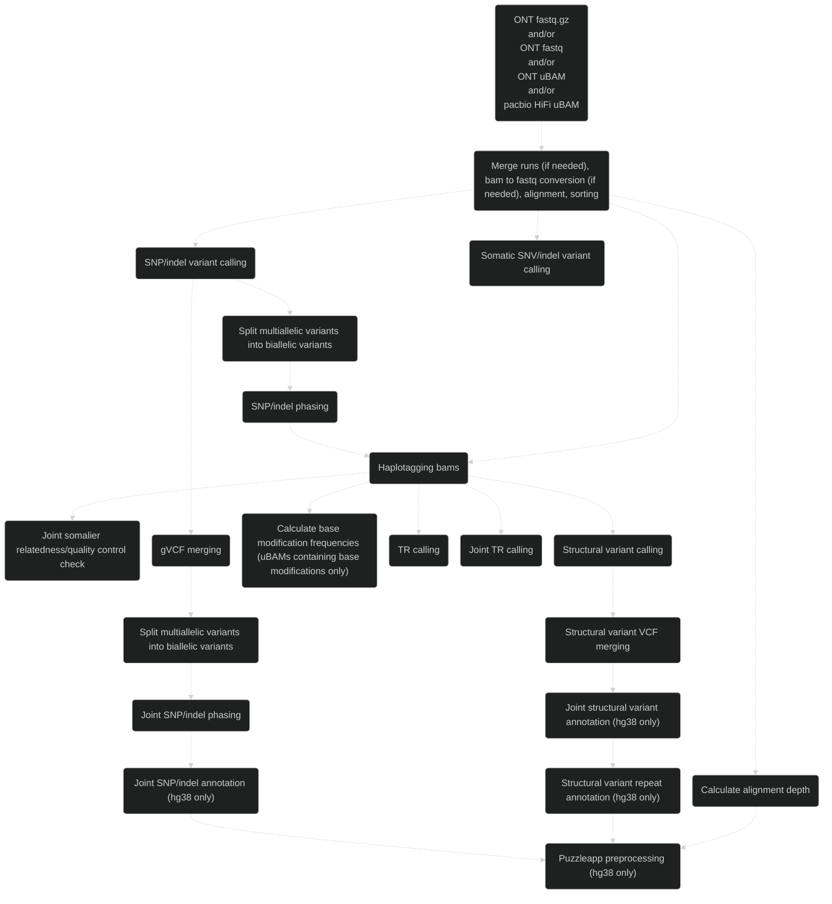
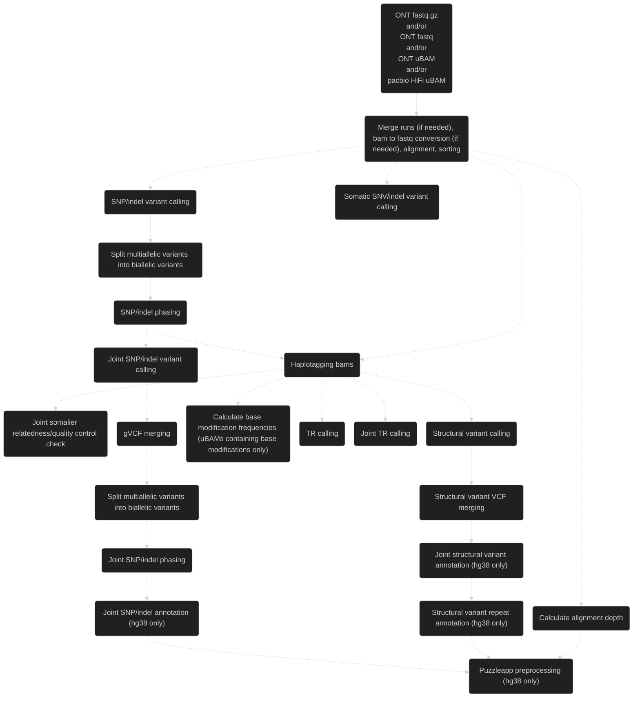

# Pipeface information

## Workflow

### Singleton

### Duo

### Trio

## Main analyses

- ONT and/or pacbio HiFi data
- Singletons, duos or trios
- WGS and/or targeted
- hg38 or chm13 reference genome

## Main tools

- [Minimap2](https://github.com/lh3/minimap2)
- [Clair3](https://github.com/HKU-BAL/Clair3) or [DeepVariant](https://github.com/google/deepvariant)/[DeepTrio](https://github.com/google/deepvariant/blob/r1.10/docs/deeptrio-details.md)
- [WhatsHap](https://github.com/whatshap/whatshap)
- [GLnexus](https://github.com/dnanexus-rnd/GLnexus)
- [Sniffles2](https://github.com/fritzsedlazeck/Sniffles) and/or [cuteSV](https://github.com/tjiangHIT/cuteSV)
- [Jasmine (customised)](https://github.com/bioinfomethods/Jasmine)
- [somalier](https://github.com/brentp/somalier)
- [mosdepth](https://github.com/brentp/mosdepth)
- [minimod](https://github.com/warp9seq/minimod?tab=readme-ov-file)
- [LongTR](https://github.com/gymrek-lab/LongTR)
- [ensembl-vep](https://github.com/Ensembl/ensembl-vep)
- [SVscanner](https://github.com/GenTechGp/SVscanner)
- [puzzleapp](https://github.com/GenTechGp/puzzleapp)
- [ClairS-TO](https://github.com/HKU-BAL/ClairS-TO)

## Main annotation databases

Used when variant annotation is turned on (hg38 only):

- [VEP cache](https://www.ensembl.org/info/docs/tools/vep/script/vep_cache.html) (merged Ensembl/RefSeq)
- [REVEL](https://sites.google.com/site/revelgenomics/)
- [gnomAD](https://gnomad.broadinstitute.org/)
- [ClinVar](https://www.ncbi.nlm.nih.gov/clinvar/)
- [CADD](https://cadd.gs.washington.edu/) (SNVs and indels) and [CADD-SV](https://cadd-sv.bihealth.org/)
- [SpliceAI](https://github.com/Illumina/SpliceAI)
- [AlphaMissense](https://github.com/google-deepmind/alphamissense)
- [Dfam](https://www.dfam.org/) (repeat annotation of SVs by SVscanner)
- [STRchive](https://strchive.org/) (bundled with SVscanner)

*[See the list of software and their versions used by this version of pipeface](../software_versions.txt) as well as the [list of variant databases and their versions](../database_versions.txt) if variant annotation is carried out (assuming the default [nextflow_pipeface.config](../../config/nextflow_pipeface.config) file is used).*

## Main input files

### Required

- ONT/pacbio HiFi FASTQ (gzipped or uncompressed) or unaligned BAM
- Indexed reference genome
- Clair3 models (if running Clair3)

### Optional

- Regions of interest BED file
- Tandem repeat BED file
- PAR regions BED file (if running in haploid aware mode)
- Tandem repeat calling regions (if running tandem repeat calling)
- Somalier sites file (if running relatedness check)

## Main output files

### Singleton

- Aligned, sorted and haplotagged bam
- Alignment depth per chromosome (and per region in the case of targeted sequencing)
- Phased Clair3 or DeepVariant SNP/indel VCF file
- Phased and annotated Clair3 or DeepVariant SNP/indel VCF file (hg38 only)
- Clair3 or DeepVariant SNP/indel gVCF file
- Bed and bigwig base modification frequencies for complete read set and separate haplotypes (uBAMs containing base modifications only)
- Phased tandem repeat VCF file
- Phased Sniffles2 and/or un-phased cuteSV SV VCF file
- Phased and annotated (VEP + SVscanner) Sniffles2 and/or un-phased and annotated cuteSV SV VCF file (hg38 only)
- SVscanner text diagrams of the repeat elements annotated in each SV (hg38 only)
- Puzzleapp SNP/indel and SV TSV files and coverage/VAF quality control HTML file (hg38 only)
- Somalier extracted files
- ClairS-TO somatic SNV/indel VCF files

### Duo

- Aligned, sorted and haplotagged bam
- Alignment depth per chromosome (and per region in the case of targeted sequencing)
- DeepVariant SNP/indel gVCF file
- Joint phased DeepVariant SNP/indel VCF file
- Joint phased and annotated DeepVariant SNP/indel VCF file (hg38 only)
- Bed and bigwig base modification frequencies for complete read set and separate haplotypes (uBAMs containing base modifications only)
- Phased tandem repeat VCF file
- Joint phased Sniffles2 and/or un-phased cuteSV SV VCF file
- Joint phased and annotated (VEP + SVscanner) Sniffles2 and/or un-phased and annotated cuteSV SV VCF file (hg38 only)
- SVscanner text diagrams of the repeat elements annotated in each joint SV (hg38 only)
- Puzzleapp joint SNP/indel and SV TSV files and coverage/VAF quality control HTML file (hg38 only)
- Joint phased tandem repeat VCF file
- Somalier extracted files
- Joint relatedness and quality control somalier TSV and HTML files
- ClairS-TO somatic SNV/indel VCF files

### Trio

- Aligned, sorted and haplotagged bam
- Alignment depth per chromosome (and per region in the case of targeted sequencing)
- DeepVariant SNP/indel gVCF file
- Joint phased DeepTrio SNP/indel VCF file
- Joint phased and annotated DeepTrio SNP/indel VCF file (hg38 only)
- Bed and bigwig base modification frequencies for complete read set and separate haplotypes (uBAMs containing base modifications only)
- Phased tandem repeat VCF file
- Joint phased Sniffles2 and/or un-phased cuteSV SV VCF file
- Joint phased and annotated (VEP + SVscanner) Sniffles2 and/or un-phased and annotated cuteSV SV VCF file (hg38 only)
- SVscanner text diagrams of the repeat elements annotated in each joint SV (hg38 only)
- Puzzleapp joint SNP/indel and SV TSV files and coverage/VAF quality control HTML file (hg38 only)
- Joint phased tandem repeat VCF file
- Somalier extracted files
- Joint relatedness and quality control somalier TSV and HTML files
- ClairS-TO somatic SNV/indel VCF files

> [!NOTE]
> - Running DeepVariant/DeepTrio on ONT data assumes r10 data
> - Running base modification analyses assumes the input data is in uBAM format and base modifications are present in these data

## Haploid Aware Mode

- Enables correct handling of the haploid nature of chrX and chrY for XY samples, along with PAR regions
- Only supported for singletons at the moment

