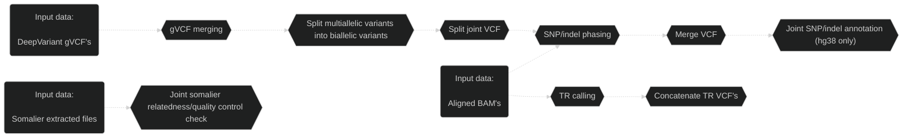

# Popface information

## Workflow

## Main analyses

- Quads to populations

## Main tools

- [GLnexus](https://github.com/dnanexus-rnd/GLnexus)
- [WhatsHap](https://github.com/whatshap/whatshap)
- [somalier](https://github.com/brentp/somalier)
- [Samtools](https://github.com/samtools/samtools)
- [ensembl-vep](https://github.com/Ensembl/ensembl-vep)

*[See the list of software and their versions used by this version of popface](../software_versions.txt) as well as the [list of variant databases and their versions](../database_versions.txt) if variant annotation is carried out (assuming the default [nextflow_popface.config](../../config/nextflow_popface.config) file is used).*

## Main input files

### Required

- Indexed reference genome

### Optional

- DeepVariant gVCF files and aligned BAM files
- Somalier extracted files

## Main output files

- Joint phased DeepVariant SNP/indel VCF file
- Joint phased and annotated DeepVariant SNP/indel VCF file (hg38 only)
- Joint relatedness and quality control somalier TSV and HTML files

